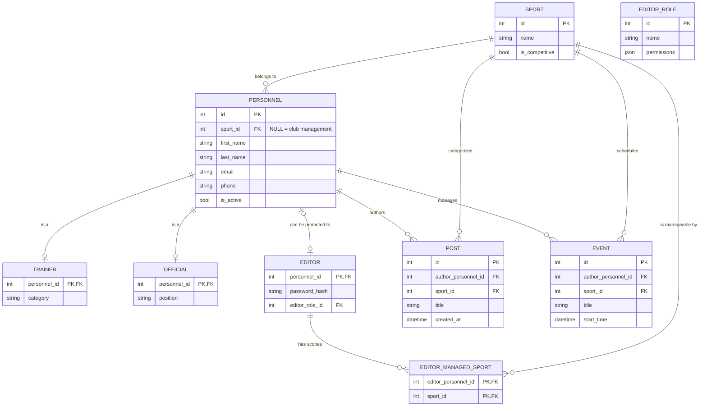

# Backend API

Base URL: `http://localhost:3000/api`

Auth uses NextAuth.js sessions (JWT). Pass the session cookie from `/api/auth/signin`.

---

## Auth

### POST /api/auth/signin
NextAuth credentials login.

**Body:**
```json
{ "email": "admin@vsk.cz", "password": "Admin1234!" }
```

**Errors:** 401 if wrong credentials; account locked after 5 failed attempts for 15 minutes.

---

### POST /api/auth/invitation/accept
Set first password using an invitation token.

**Body:**
```json
{ "token": "<raw token>", "password": "NewPass123!" }
```

**Response:** `{ "success": true }`

---

## Public

### GET /api/sports
Returns all sports.

**Response:**
```json
[{ "id": 1, "name": "Atletika", "isCompetitive": true, "description": "..." }]
```

---

### GET /api/posts
Paginated published posts.

| Param | Type | Description |
|-------|------|-------------|
| `search` | string | Full-text search on title/excerpt |
| `sportId` | number | Filter by sport |
| `page` | number | Page number (default: 1) |
| `limit` | number | Items per page (default: 10, max: 50) |

**Response:**
```json
{
  "data": [{ "id": 1, "title": "...", "excerpt": "...", "imageUrl": null, "publishedAt": "...", "sport": { "id": 1, "name": "Atletika" }, "author": { "id": 1, "firstName": "Petr", "lastName": "Dvořák" } }],
  "total": 10,
  "page": 1,
  "limit": 10
}
```

---

### GET /api/posts/:id
Single published post with media.

**Response:**
```json
{ "id": 1, "title": "...", "content": "...", "media": [{ "mediaUrl": "...", "mediaType": "image" }], ... }
```

404 if not found or unpublished.

---

### GET /api/events
Public events filtered by date range and sport.

| Param | Type | Description |
|-------|------|-------------|
| `from` | ISO date | Start of range |
| `to` | ISO date | End of range |
| `sportId` | number | Filter by sport |

---

### GET /api/events/:id
Single event detail. 404 if not found or not public.

---

### GET /api/contacts
Personnel directory (active only).

| Param | Type | Description |
|-------|------|-------------|
| `search` | string | Name or email search |
| `sportId` | number | Filter by sport |

**Response:** includes `trainer` (category) and `official` (position) sub-objects when applicable.

---

## Partner Orders

### POST /api/partner-orders
Submit a partner order. No auth required.

**Body:**
```json
{
  "partnerName": "Nutrend",
  "email": "partner@example.com",
  "details": "Order details...",
  "requesterPersonnelId": 1
}
```

---

### GET /api/partner-orders
**Auth: superadmin**

Returns all orders ordered by creation date.

---

### PATCH /api/partner-orders/:id/status
**Auth: superadmin**

**Body:**
```json
{ "status": "processing" }
```

Allowed statuses: `submitted`, `processing`, `completed`, `rejected`.

---

## Admin

All admin routes require a session. `sport_manager` role is scoped to their assigned sports — requests with a mismatched `sportId` return 403.

### POST /api/admin/posts
**Auth: superadmin | sport_manager**

**Body:**
```json
{
  "sportId": 1,
  "title": "Post title",
  "content": "Full content...",
  "excerpt": "Short summary",
  "imageUrl": "https://...",
  "isPublished": true,
  "publishedAt": "2026-04-01T10:00:00.000Z"
}
```

---

### PATCH /api/admin/posts/:id
**Auth: superadmin | sport_manager**

Partial update. Same fields as POST, all optional.

---

### POST /api/admin/events
**Auth: superadmin | sport_manager**

**Body:**
```json
{
  "sportId": 1,
  "title": "Event name",
  "startTime": "2026-05-10T09:00:00.000Z",
  "endTime": "2026-05-10T17:00:00.000Z",
  "location": "Atletický stadion",
  "eventType": "match",
  "description": "...",
  "ticketUrl": "https://...",
  "mapUrl": "https://maps.google.com/...",
  "isPublic": true
}
```

`eventType` values: `match`, `training`, `meeting` (open string).

---

### PATCH /api/admin/events/:id
**Auth: superadmin | sport_manager**

Partial update. All event fields optional. Set `isCancelled: true` to cancel.

---

### POST /api/admin/users
**Auth: superadmin**

Creates personnel, editor account, and invitation token in one transaction. Returns the raw `invitationToken` — send it to the user via email so they can set their password.

**Body:**
```json
{
  "firstName": "Jana",
  "lastName": "Nováková",
  "email": "jana@vsk.cz",
  "phone": "+420 600 000 000",
  "sportId": 1,
  "editorRoleId": 2,
  "managedSportIds": [1, 2],
  "isTrainer": true,
  "trainerCategory": "II. třída",
  "isOfficial": false
}
```

**Response:**
```json
{ "personnel": { "id": 3, ... }, "invitationToken": "<raw token>" }
```

---

### GET /api/admin/users/stats
**Auth: superadmin**

**Response:**
```json
{
  "total": 2,
  "byRole": [
    { "role": "superadmin", "count": 1 },
    { "role": "sport_manager", "count": 1 }
  ]
}
```

---

### POST /api/admin/sports
**Auth: superadmin**

**Body:**
```json
{
  "name": "Basketbal",
  "isCompetitive": true,
  "description": "Basketbalový oddíl",
  "headOfficialPersonnelId": 2
}
```

---

## Data model (Mermaid ER)



Rendered image:


